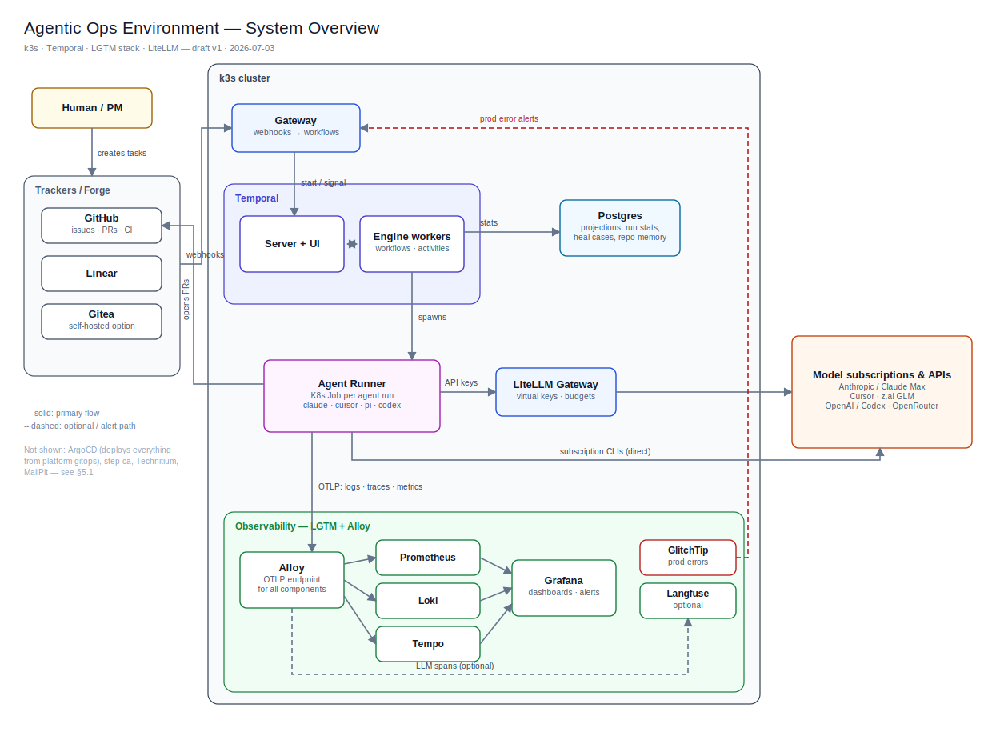

# agentops-engine

The engine of **Agentic Ops** — a self-hosted home for autonomous dev agents.

Write your idea down as a tracker issue in the evening, add a label, go to sleep.
The engine designs, plans, implements, reviews, and babysits the PR until CI is
green — as a durable [Temporal](https://temporal.io) workflow that survives
crashes, redeploys, and provider rate limits. The agents themselves are pluggable
CLIs (`claude`, `pi`, …) running in disposable Kubernetes Jobs.

The guiding idea: **the human provides the intent; implementation, QA, monitoring,
delivery, bug fixing, and support can be automated.**

This repo is the engine: workflows, activities, agent backends, images, and the
Helm chart. Deploy state (GitOps, Argo CD, secrets) lives in the companion
**`agentops-platform`** repo.

## What it does

- **Issue → merge-ready PR** (`devCycle`) — the core loop: Design → Plan →
  Implement → Review → PR babysit, triggered by labeling a GitHub or Linear issue.
- **PR review repair** (`devCyclePrRepair`) — picks up review comments on labeled
  PRs, resolves them, keeps CI green.
- **Bug hunting** (`whiteboxBugHunt`) — scheduled read-only sweeps of a repo that
  file deduplicated, labeled issues.
- **Platform agent & chat** (`platform`, `platformChat`) — ask the running system
  about itself; it answers with Temporal history and logs as evidence.
- **Self-healing** (`selfHeal`) — the platform periodically inspects its own
  failed runs and proposes fixes for its own code.
- **Custom agents per project** — a git-committed
  [`agents.json`](docs/agents-json.md) schedules built-in workflows (Tier 1), or a
  project ships its own Temporal workflows with `@agentic-ops/engine-sdk` running in
  its own worker (Tier 2) — see
  [authoring project workflows](docs/authoring-project-workflows.md).

Design principles: as autonomous as possible; durable, resumable execution;
observable (OTel → Loki/Tempo/Prometheus → Grafana); self-hosted and scalable;
multi-model and multi-provider with rate-limit fallback; token/iteration budget
brakes; and dogfooded — this system is built and maintained by the agents it hosts.

## Architecture



- [docs/temporal-architecture.md](docs/temporal-architecture.md) — how Temporal
  workflows, task queues, and workers map onto this repo's packages, and how the
  worker bursts agent runs out into disposable k8s Jobs.
- [docs/software-lifecycle-vision.md](docs/software-lifecycle-vision.md) — the
  target development lifecycle and the authority for future workflow changes.
- `packages/{contracts,ports,backends,policies,workflows,activities,worker,cli,gateway,control,ui,prompts,engine-sdk}` —
  workflows are deterministic policy; activities are all I/O; ports isolate
  forge/tracker SDKs; backends isolate agent CLIs. Working rules in
  [AGENTS.md](AGENTS.md).
- Historical feature design notes live in
  [docs/superpowers/specs/](docs/superpowers/specs/).

## Adding a repo

Register the repo in Mission Control → **Projects**. Add `agentops.json` at the repo
root so the engine knows how to verify and route work. Point the repo's GitHub webhook at
`POST https://<gateway>/webhooks/github` (Issues events, shared secret) — then label an
issue `agentops` to start a run.

Optional auto-merge policy in `agentops.json` (disabled by default):

```json
{
  "autoMerge": "label"
}
```

Modes: `disabled` (default kill switch), `label` (merge when the PR carries `automerge`),
`all` (merge AgentOps-created PRs without a label). `automerge:disable` always wins.
AgentOps-managed PRs receive `agentops:managed`. External enrollment uses GitHub
`Pull request` and `Pull request review` webhook events in addition to Issues.

## Images & chart

Three images build from `images/`:

- `images/engine/Dockerfile --target worker` — the Temporal worker, same
  `tsx src/main.ts` entrypoint used locally.
- `images/engine/Dockerfile --target gateway` — the webhook receiver.
- `images/agent-runner/Dockerfile` — `git` + every agent backend's CLI
  (`claude`, `pi`) in one shared image; one disposable Job pod per agent call.

CI builds all three on every push/PR and, on merge to `main`, pushes immutable
`:<git-sha>` tags and commits that sha into `agentops-platform`'s values — Argo
CD auto-sync then rolls the cluster. No manual deploy step. (Requires the
`PLATFORM_PAT` repo secret: a fine-grained PAT scoped to the platform repo with
Contents read/write.)

`charts/engine/` is the Helm chart for the worker Deployment (RBAC to manage
agent-runner Jobs, shared workspace PVCs). It ships no real image tag or
registry — the platform repo supplies those as values overrides. Render locally:

```bash
helm template engine charts/engine --namespace <namespace>
```

## Docs

| Doc                                                                        | What it covers                                                 |
| -------------------------------------------------------------------------- | -------------------------------------------------------------- |
| [docs/software-lifecycle-vision.md](docs/software-lifecycle-vision.md)     | Target lifecycle and authority for future workflow changes     |
| [docs/temporal-architecture.md](docs/temporal-architecture.md)             | Durable-execution architecture, package map, k8s Job bursting  |
| [docs/authoring-project-workflows.md](docs/authoring-project-workflows.md) | Writing custom Tier-2 workflows with `@agentic-ops/engine-sdk` |
| [docs/project-worker-deployment.md](docs/project-worker-deployment.md)     | Deploying a Tier-2 project worker                              |
| [docs/runbooks/](docs/runbooks/)                                           | Operational runbooks                                           |
| [docs/superpowers/specs/](docs/superpowers/specs/)                         | Historical feature design notes                                |
| [docs/project-worker/](docs/project-worker/)                               | Reference Tier-2 project worker (Rollbar monitor)              |
