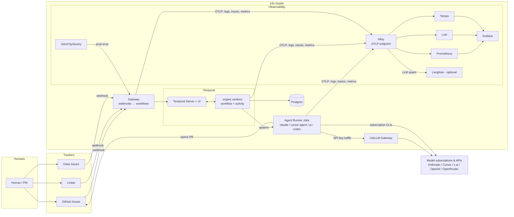

# Agentic Ops Environment — Architecture

Status: draft v1 · 2026-07-03 · Owner: Artem

An environment where autonomous agents build, verify, and improve a product with minimal human involvement. Runs on any host (laptop, VPS, bare metal) via **k3s**. Orchestrated by **Temporal**. The engine is built **greenfield**; the earlier **vibeteam** prototype serves as prior art — its battle-tested semantics carry over as requirements, its code does not.

---

## 1. Principles

- **Free / open source first.** Every platform component is self-hostable OSS. Paid money goes only to model subscriptions (Claude, Cursor, z.ai GLM, Codex, OpenRouter credits).
- **Observability is a feature, not an add-on.** Every agent run leaves a trace detailed enough that *another agent* can diagnose and fix it (this already exists in vibeteam as the heal agent — we generalize it).
- **Agents are cattle, orchestration is durable.** Agent CLI sessions are disposable pods; all state that matters lives in Temporal histories + Postgres.
- **Pluggable everything:** agent backends (`claude` / `cursor-agent` / `pi` / `codex`), trackers (GitHub / Linear / Gitea), models per stage.
- **Safety brakes everywhere:** token, iteration, and time budgets enforced by the workflow, not by trust in the agent.

## 2. Prior art: vibeteam → requirements

Vibeteam (a single-host Node/TS prototype) proved the pipeline and, more importantly, accumulated failure-mode knowledge. The greenfield engine inherits these as **hard requirements**, not code:

- **Stage lifecycle** (proven): `context → assess(optional) → design → plan → implement → full_verify → review → pr → pr_babysit → done`.
- **Repair-loop semantics:** fixer builds on existing work, never reverts the worktree (reverts caused oscillation); one fixer addresses full-verify + review findings together; exhausted rounds **open the PR anyway** with findings posted — review never dead-ends a task.
- **Fail-safe verdict parsing:** sentinel-based (`VERDICT:`, `FULL:`), unparseable → bounded retry → retryable FAIL, never silent pass, never human-block on garbage.
- **Safety brakes:** `maxImplementAttempts`, `maxIterations`, `maxTokens`, babysit round cap — enforced by the orchestrator, with model **escalation tier** on the final attempt.
- **Babysit correctness:** merge-ready = CI green *and* zero unresolved threads; each distinct feedback set processed once (hash dedupe); `done` is demotable if the PR regresses.
- **Human artifacts win:** human-authored design/plan are used verbatim; `blocked` + `clarify`/`resume` escape hatches.
- **Learning:** `repo_memory` conventions injected into later prompts; `heal_cases` corpus; `agent_run_stats` (tokens, tok/s, cost, outcome) on every run.

Everything vibeteam built *around* these — SQLite stage-results, crash resume, poll loop, concurrency lanes, per-repo daemon — was a hand-rolled durable-execution engine. Temporal provides that layer natively; the new engine implements only the semantics above.

## 3. Why Temporal (decision record)

Chosen over Argo Workflows and plain K8s Jobs because:

- Workflows are **TypeScript code** — the repair loop, brakes, and babysit policy (§2) are naturally expressed as a workflow function, not re-encoded in YAML DAGs.
- **Durable timers and signals** model the awkward parts natively: pr_babysit (wait days for CI/review events), `blocked` → human `clarify` → resume, demoting a `done` task when its PR regresses.
- **Deterministic replay** gives a perfect audit log of every decision the orchestrator made — raw material for the meta-optimizer agent.
- Cost: self-hosted Temporal (MIT) + Postgres in k3s. Trade-off accepted: we run worker deployments instead of pure-YAML pipelines.

Argo Events was rejected as trigger layer too — a thin **Gateway** service (webhook receiver → `startWorkflow`) is ~200 lines and one less CRD stack.

## 4. System overview



## 5. Components

### 5.1 Cluster base & GitOps
- **k3s** single-node to start; nothing below assumes multi-node. Traefik (bundled) for ingress.
- **ArgoCD** as the GitOps engine: one platform repo (app-of-apps) holds all manifests/Helm values; a fresh host bootstraps with `k3s install → argocd install → apply root app`. Everything else — Temporal, LGTM, LiteLLM, the product itself — reconciles from git. This also makes the platform *agent-operable*: an agent changes infrastructure by opening a PR against the platform repo, which goes through the same DevCycle pipeline as product code.
- **Secrets: SOPS + age.** Secrets live encrypted in the same git repo (age recipients = ArgoCD's key + admin keys), decrypted only at deploy time via the KSOPS/helm-secrets plugin inside ArgoCD's repo-server. Consequence for agent safety: agents can read the whole platform repo (and even edit secret *structure*) without ever seeing plaintext values; the age private key exists only in the ArgoCD namespace, never in agent pods.
- **TLS: step-ca** as internal certificate authority with an ACME provisioner; **cert-manager** points at it as an ACME issuer, so every internal service gets real, auto-renewed certificates. Its root cert is baked into agent-runner images — no self-signed warnings, no `NODE_TLS_REJECT_UNAUTHORIZED=0` creeping into agent-written code.
- **DNS: Technitium DNS** serving an internal zone (e.g. `*.lab`) pointed at the cluster ingress: `temporal.lab`, `grafana.lab`, `git.lab`, `mail.lab`, preview deploys as `pr-123.app.lab`. No hosts-file sprawl, no `srv01:8443`-style addresses; combined with step-ca, internal URLs behave exactly like production ones — which matters because agents (and Playwright) hit them constantly.
- **Mail: MailPit** as the SMTP sink for all non-prod outbound mail — test emails never reach real people. Its REST API doubles as a *test surface*: QASquad and ProductProbe agents verify signup confirmations, resets, and notification content by reading the trap.
- **Container registry: self-hosted** (`gitactions.est1908.top`, valid Let's Encrypt TLS). Engine images (`agent-<backend>`, worker, gateway) and product images push here from CI over basic auth (`REGISTRY_USERNAME`/`REGISTRY_PASSWORD`); the cluster pulls via a basic-auth `imagePullSecrets` entry (`imagePullSecretName` chart value, default `registry-credentials`). Superseded the original GHCR choice (2026-07-06) once a self-hosted registry existed anyway — note this reopens the operational tradeoff GHCR was originally chosen to avoid (one more stateful service: GC, storage, backups, uptime).

### 5.2 Temporal
- Official Helm chart, Postgres persistence (shared Postgres instance, separate DB).
- Namespaces per environment (`prod-agents`, `dev-agents`).
- **Workers**: one Deployment running the engine's workflow + activity code. Replicas + task-queue slots = concurrency. One worker fleet serves all repos and products (repo/product are workflow arguments).

### 5.3 Gateway (trigger layer)
Small HTTP service (part of the engine repo):
- Receives webhooks: tracker issue labeled → start `DevCycle`; GlitchTip/Alertmanager alert → start `ProdErrorTriage`; forge PR events → signal the owning workflow (replaces babysit *polling* with event push; a slow durable-timer poll stays as fallback).
- Normalizes all trackers into one `TaskEvent` shape via `TrackerPort` — GitHub, Linear, and Gitea are config, not code paths.

### 5.4 Agent Runner
The only place agent CLIs execute. An activity `runAgent(stage, backend, model, prompt, workspaceRef)`:

1. Launches a **K8s Job** from a shared `agent-runner` image carrying every backend's CLI (`claude`, `pi`, ...) — pinned CLI versions, one image to build/push/roll instead of one per backend. Decided 2026-07-06: the CLIs verified so far are thin `npm install -g` wrappers on the same `node:22-slim` base with no conflicting system deps, so per-backend images (the original plan) added build/deploy overhead without a matching benefit. Revisit the split if a future backend (`cursor`, `codex`) needs a meaningfully different or heavier toolchain — nothing here requires all backends to share an image forever, only that they do while the CLIs stay this lightweight.
2. Workspace = clone of the repo at the task branch. Worktrees on shared PVC (fast, single-node) → later object-storage bundle per task (multi-node ready). Base-clone cache PVC to avoid full reclones.
3. Streams stdout/stderr and OTel spans → Alloy (→ Loki/Tempo); parses CLI JSON output for token usage & tok/s → Postgres `agent_run_stats`.
4. Activity **heartbeats** while the Job runs; timeout/cancel kills the Job. Exit sentinel (`VERDICT:`, `FULL:`) returned to the workflow.

Security: Jobs run non-root in a dedicated namespace, `NetworkPolicy` allowing only forge, LiteLLM, and provider endpoints; CPU/mem limits; no cluster API access.

### 5.5 Model access & credentials
Two lanes, matching how subscriptions actually work:

- **Subscription CLIs** (Claude Max, Cursor, Codex, z.ai GLM plan): the CLI authenticates itself; this is the *primary* lane for the heavy stages because subscription pricing beats per-token API cost. Headless auth is a solved problem per backend:
  - `claude`: run `claude setup-token` once (interactive, one-year OAuth token tied to the Pro/Max subscription) → store SOPS-encrypted → inject as `CLAUDE_CODE_OAUTH_TOKEN` into runner Jobs. Renewal is a yearly manual step; the Heal workflow should recognize auth-expiry as a distinct failure class.
  - `cursor-agent`: headless/CI auth via `CURSOR_API_KEY` from the dashboard, tied to the Cursor subscription.
  - `codex`: ChatGPT-subscription sign-in produces an auth file injectable the same way; API-key fallback.
  - z.ai GLM plan plugs into the `claude` backend via `ANTHROPIC_BASE_URL` + key swap — one backend, two providers.

  All tokens live as SOPS secrets in `agentops-platform`, mounted per-backend; runner NetworkPolicy restricts egress to that provider. Usage is captured from CLI JSON output per run. Caveats: rate windows (prompts per 5h/week) are a scheduling input for the budget layer — parallel Job count per subscription must respect them; provider ToS on automation should be checked per provider before scaling swarm-style workflows.
- **API-key traffic** (OpenRouter, z.ai API, direct Anthropic/OpenAI API, embeddings, the platform's own LLM calls): routed through **LiteLLM** gateway — unified OpenAI-compatible endpoint, virtual keys per agent role, **hard budget caps per key**, spend logging, model fallbacks.

Model routing policy lives in config: per stage (cheap model for `context`, strong for `implement`, escalation tier for final attempt) and per workflow type (bug hunting on cheap subscriptions, prod fixes on strong models).

### 5.6 Observability (LGTM stack + Alloy)

Single ingestion point: **Grafana Alloy** exposes one OTLP endpoint for every app, worker, and agent pod. Nothing ships logs/traces directly to a backend — Alloy routes:

- metrics → **Prometheus** (also scrapes k3s/Temporal/LiteLLM exporters)
- logs → **Loki** (agent stdout/stderr, product logs, platform logs)
- traces → **Tempo** (agent runs are one trace: stage span → CLI span → LLM-call spans, via OpenLLMetry/OTel instrumentation)
- dashboards/alerts → **Grafana** on top of all three (and yes — Loki, Tempo, Grafana: it does sing)

| Layer | Question | Where |
|---|---|---|
| Infra/app | Is the platform healthy? Is the *product* healthy? | Prometheus + Loki + Grafana; GlitchTip or self-hosted Sentry for product errors |
| Orchestration | What did each task do, where is it stuck? | Temporal Web UI (every workflow, every retry), search attributes: repo, stage, status, backend |
| Agent cognition | What did the agent think/spend? | Tempo traces (LLM spans carry prompt/token/cost attributes). Optional: Alloy fans LLM spans out to **Langfuse** too, if we want prompt-diff UX, scoring, and eval datasets beyond what Grafana gives |

Everything queryable by agents: Healer and Meta-Optimizer read Temporal histories, Loki, and Tempo (and Langfuse if enabled) through read-only APIs. Instrumentation is OTel-standard, so backends stay swappable.

### 5.7 Multi-product topology

**One shared agent-ops cluster serves all products** — the platform stack (Temporal, LGTM, ArgoCD, LiteLLM, step-ca, Technitium, MailPit) is not duplicated per product. Duplicating it would multiply resource/maintenance cost by N and fork the learning loop: eval scores, heal cases, budget analytics, and routing recommendations are most valuable aggregated across all products. The design is already multi-product: repo/product is a workflow argument, one worker fleet serves all repos.

**Per-product isolation inside the cluster:**

- **Namespace per product** (`prod-a-agents`, `prod-a-preview`, …) for agent Jobs and preview deploys.
- **ResourceQuota + LimitRange** per namespace — one product's QASquad can't starve another's DevCycle.
- **NetworkPolicy** — product A's agents cannot reach product B's services or previews; all agents reach only forge, LiteLLM, and their own product's endpoints.
- **Budget separation** — LiteLLM virtual keys per product×role; Temporal search attributes (`product`) make every dashboard, budget report, and routing recommendation sliceable per product.
- **DNS/TLS** — per-product subzones (`pr-123.prod-a.lab`) via Technitium + step-ca, no cross-product ambiguity.
- **Escalation path**: if a product ever needs hard isolation (untrusted code, client contract), give it a **vcluster** — a virtual k3s inside the shared one — before considering a physically separate cluster.

**Production stays out.** Each product's prod runs on its own host/cluster, added to the central ArgoCD as a destination. Platform incidents, agent swarms, or noisy ProductProbe runs can never touch any prod; agents can't either — deploys happen only via ArgoCD sync.

### 5.8 Repository layout (N products + 2)

| Repo | Contents | Changed by |
|---|---|---|
| **`agentops-engine`** (greenfield) | Platform *code* monorepo: workflows, activities, ports, backends, Gateway, agent-runner Dockerfiles, shared role packs. Product-agnostic. CI builds & pushes images. See §5.9. | Humans + DevCycle (the platform develops itself) |
| **`agentops-platform`** | Platform *state*: ArgoCD app-of-apps, Helm values for Temporal/LGTM/LiteLLM/step-ca/Technitium/MailPit, SOPS-encrypted secrets, per-cluster env overlays, **product registry** (one ArgoCD Application/ApplicationSet entry per product), pinned image tags. | Humans + agents via PR; ArgoCD watches only this repo |
| **N product repos** | Product code + its own `deploy/` manifests (ArgoCD Application targets this path) + `agentops.json` agent config (zod-validated `ProductConfig`): verify commands, stage/model routing, prompts overrides, budgets. | Product DevCycle agents |

Why this split and not one monorepo:

- **Code/state separation is the standard ArgoCD pattern** — it avoids the CI loop (image build commit → sync → build …): `agentops-engine` CI pushes an image, a bot/agent PR bumps the tag in `agentops-platform`, ArgoCD syncs. Rollback = git revert in one place.
- **Blast-radius & access match repo boundaries**: product agents get write access only to their product repo; only platform-role agents (and humans) touch `agentops-platform`; SOPS secrets live where code-churning agents don't work daily.
- **Deploy manifests live in the product repo** so an agent changes app code and its manifests in *one atomic PR* through one review gate — the gitops repo only registers the product and holds env-specific values/secrets.
- **Onboarding a new product = one PR** to `agentops-platform` (register Application, namespace, quotas, LiteLLM keys, DNS subzone). An ApplicationSet generator can automate even that from a repo label. Concretely, for forge access: a **project registry** (`projects` map in the engine chart values, one entry per product — `repo`, `githubTokenSecretName`) replaces the single global `GITHUB_TOKEN` this repo shipped with through M2; the worker builds one scoped GitHub client per registered repo instead of sharing one token across every product. See [project-registry-design.md](superpowers/specs/2026-07-06-project-registry-design.md) for the full design and onboarding runbook.

Not a product monorepo: products have different lifecycles, and access boundaries are the isolation mechanism (§5.7).

**`agentops-platform` structure:**

```
agentops-platform/
  bootstrap/                  # everything before ArgoCD manages itself
    k3s-install.md            # host prep, one documented path (M2 gate)
    root-app.yaml             # ArgoCD app-of-apps entrypoint
  clusters/
    ops/                      # the shared agent-ops cluster
      platform/               # one ArgoCD Application per component
        temporal/  postgres/  litellm/  lgtm/       # helm values
        argocd/  step-ca/  technitium/  mailpit/  glitchtip/
      engine/
        values.yaml           # engine chart values, pinned image tags
      products/               # product registry
        product-a.yaml        # Application → product repo /deploy path,
        product-b.yaml        #   namespace, quotas, DNS subzone
    prod-product-a/           # destination cluster defs (prod stays out, §5.7)
  secrets/                    # SOPS-encrypted (age)
    model-tokens/             # CLAUDE_CODE_OAUTH_TOKEN, CURSOR_API_KEY, z.ai, codex
    forge/  litellm/  smtp/
  .sops.yaml                  # age recipients, path rules
```

**Product repo structure (each product):**

```
product-a/
  src/ ...                    # the product itself, any language
  deploy/                     # ArgoCD Application target
    base/  overlays/preview/  overlays/prod/
  agentops.json               # ProductConfig: verify commands (fast/full),
                              #   stage→model routing, budgets, prompt overrides,
                              #   review mandate, hooks, triggers & jobs (§6.1)
  agentops/prompts/           # product prompt packs (localization job, etc.)
  .github/workflows/ci.yaml   # CI the babysit loop watches
```

(Engine repo tree — §5.9.)

### 5.9 Engine repo — greenfield design

pnpm/TS monorepo, Temporal TS SDK. The load-bearing rule: **workflows are deterministic policy, activities are all I/O.**

```
packages/
  contracts/    # zod schemas, the engine's spine: TaskEvent, StageResult,
                # Verdict, RunStats, RoleManifest, ProductConfig
  ports/        # TrackerPort, ScmPort + adapters: github, gitea, linear
  backends/     # AgentBackend interface + adapters: claude, cursor, pi, codex, stub
                # (spawn CLI, stream output, parse usage & sentinels)
  prompts/      # versioned prompt packs per stage/role; template engine
  policies/     # pure functions encoding §2: repairLoop, brakes, verdictParse,
                # feedbackHash, escalation — unit-tested in isolation
  workflows/    # devCycle, heal, bugHunt, securityReview, evalRun, qaSquad,
                # productProbe, metaOptimize, budgetReport
  activities/   # runAgent (K8s Job launcher), forge ops, tracker ops,
                # workspace mgmt, notifications, stats writes
  gateway/      # webhook receiver → startWorkflow / signal
  worker/       # Temporal worker entrypoints
  cli/          # admin CLI: start, resume, clarify, inspect, replay
  ui/           # Mission Control: React SPA + BFF (§5.10)
images/         # Dockerfiles: worker, gateway, agent-runner (shared across backends, §5.4)
charts/         # Helm chart (values live in agentops-platform)
```

Design decisions (where this improves on the prototype):

1. **Role-as-manifest from day one.** A role = `{workflow, promptPack, allowedTools, budget, schedule?}` validated by `contracts`. DevCycle is merely the first role — Phase 4 becomes pure config.
2. **One activity contract for all agent execution.** `runAgent({backend, model, promptRef, workspaceRef, limits}) → {sentinel, usage, artifacts}` launches a K8s Job, heartbeats, kills on cancel. Workflows never know *how* agents run; swapping local-spawn for Jobs (or nanoClaw later) touches one activity.
3. **Policies as pure functions.** The §2 semantics live in `policies/` with exhaustive unit tests — independent of Temporal, independent of backends. This is where the vibeteam lessons are encoded and protected against regression.
4. **Temporal is the only state machine.** No event bus, no task DB. Postgres holds *projections only*: `agent_run_stats`, `heal_cases`, `repo_memory`, eval scores — written by activities, read by analytics and the meta-agents.
5. **Product config lives in the product repo** (`agentops.json` or similar, zod-validated `ProductConfig`): verify commands, stage/model routing, budgets, prompt overrides. The engine ships defaults.
6. **Testing built in from the start:** Temporal's `TestWorkflowEnvironment` for time-skipped workflow tests (babysit timers, brakes); the `stub` backend for full-pipeline e2e without spending tokens; golden-file snapshots for prompts.
7. **Worktrees:** base-clone cache PVC + `git worktree` per task, owned by workspace activities — same mechanics the prototype validated.

### 5.10 Mission Control — React web UI

Three UIs come for free and are *not* rebuilt: **Temporal Web UI** (workflow forensics: history, retries, stack traces, terminate), **Grafana** (metrics, costs, alerts), and the **tracker** (creating/labeling an issue *is* the primary "run agent" button). **Mission Control** is a React SPA (`packages/ui` + small BFF over Temporal SDK, Postgres projections, and Loki; served at `control.lab`), covering only what those three can't:

- **Board:** all tasks across products/workflow types (Temporal visibility search on `product`, `stage`, `status`, `backend`), one row per running/blocked/recent workflow.
- **Actions:** start a `DevCycle` (pick repo + issue, or ad-hoc prompt task), `resume`/`clarify` blocked tasks, stop/cancel, retry, "run now" for any Schedule (BugHunt tonight, not Sunday), pause a product.
- **Run detail:** stage timeline with verdicts and token/cost per stage, live agent output (Loki tail), diff preview, and deep links into Temporal UI / Grafana / Langfuse for anything deeper.
- **Budgets:** subscription window usage (prompts left in the 5h window per plan), spend per product×role, brake events.
- **Knowledge:** browse `heal_cases`, `repo_memory`, eval scores; edit role manifests (Phase 4) — edits land as PRs to the engine repo, not direct writes.

Auth: behind Traefik + step-ca; single-user basic auth/OIDC to start. Everything Mission Control does goes through the same engine APIs agents use — it's a client, not a second control path. Live updates via SSE/WebSocket (workflow events + Loki tail), so a running agent's output streams into the browser.

## 6. Workflow catalog

| Workflow | Trigger | Maps to use case |
|---|---|---|
| `DevCycle` | Tracker webhook (label) | Human creates task → design→plan→build→review→CI→PR→babysit |
| `Heal` | Auto: `DevCycle` ends `blocked`/`failed` | Diagnose & fix agent-side failures (generalized vibeteam heal agent) |
| `ProdErrorTriage` | GlitchTip/Alertmanager webhook | Prod error → reproduce → file issue → optionally auto-start `DevCycle` with hotfix policy |
| `BugHunt` | Schedule (cron) | Recurrent bug hunting per repo; files issues (vibeteam issue-jobs pattern) |
| `SecurityReview` | Schedule | Recurrent security audit; SAST tools (Semgrep/Trivy) + agent review; files issues |
| `EvalRun` | Schedule / on model change | Runs agent evals; writes scores to Postgres; feeds routing policy |
| `QASquad` | Schedule / pre-release | N parallel QA agent sessions against a preview deploy (Playwright MCP); email flows verified via MailPit API; files issues |
| `ProductProbe` | Schedule | "Fake company" personas exercise the product end-to-end via browser/API, including email loops through MailPit; UX findings → issues |
| `MetaOptimize` | Schedule (weekly) | Reads Temporal histories + Langfuse + `agent_run_stats`; files issues *on the platform repo* about wasted tokens, flaky stages, slow models |
| `BudgetReport` | Schedule (daily) | Aggregates spend/speed per repo/role/model; Grafana dashboard + report; recommends routing changes |

All non-DevCycle workflows reuse the same Agent Runner and ports — a "role agent" (Phase 4) is just: workflow definition + prompt pack + allowed tools + budget. Adding marketing or cost-adviser agents is config + one workflow file, not new infrastructure.

### 6.1 Product-defined triggers & jobs

Products extend the platform **declaratively** — `agentops.json` grows two sections, validated by `contracts`, requiring no engine code:

```jsonc
{
  "triggers": [
    {
      "name": "external-errors",           // e.g. Sentry SaaS, Rollbar, client's system
      "type": "webhook",                   // or "poll" for sources without webhooks
      "secretRef": "product-a/errors-api", // SOPS secret in agentops-platform
      "poll": { "every": "5m", "cursor": "lastSeenId" },   // poll-type only
      "filters": { "environment": "production", "minEvents": 10 },
      "dedupe": "fingerprint",             // one task per error group, not per event
      "start": { "workflow": "ProdErrorTriage", "profile": "incident" }
    }
  ],
  "jobs": [
    {
      "name": "localization",
      "schedule": "0 6 * * 1",             // weekly: find untranslated strings → PR
      "workflow": "DevCycle",              // goal-driven, no tracker issue needed
      "promptPack": "agentops/prompts/localization.md",
      "budget": { "maxTokens": 2000000 },
      "output": "pr"                       // or "issues" — file findings instead
    }
  ]
}
```

How it runs:

- **Reconciliation:** a `ConfigSync` workflow watches product-repo pushes (via Gateway) and reconciles declared triggers/jobs into reality — Temporal Schedules created/updated/deleted, Gateway webhook routes registered, poll loops (Schedule + fetch activity with durable cursor) started. Config *is* the state; deleting the entry deletes the automation.
- **Webhook triggers** get a per-trigger URL + secret; payloads are normalized to `TaskEvent` by a mapping the trigger declares (or a small adapter in `ports/` if the source is common enough to share — that's the one case that touches engine code, once per *source type*, reusable by every product).
- **Poll triggers** cover sources without webhooks: durable cursor in workflow state, dedupe by fingerprint so a noisy error group becomes one task.
- **Jobs** are the generalized recurrent pattern (localization, dependency bumps, docs regeneration, changelog writing): schedule + prompt pack + budget, output as PR or filed issues. Prompt packs live in the product repo (`agentops/prompts/`), so iterating on the localization prompt is a normal product PR — reviewable, revertable, and improvable by agents themselves.
- Everything downstream is unchanged: same DevCycle policies, brakes, babysit, observability, and budget accounting — a localization run shows up in Grafana next to everything else.

### 6.2 Worked example: marketing agent (changelog → marketing site)

A product wants its web-marketing site updated whenever a release ships. This composes existing pieces — no engine changes — and exposes one pattern worth naming: **cross-repo tasks** (trigger fires in one repo, the PR lands in another).

1. **The marketing site is just another product**: its own repo with `deploy/` (so it gets preview deploys at `pr-N.marketing.lab`) and its own `agentops.json` — verify commands are things like build + linkcheck, not unit tests.
2. **The role lives with the content owner**: `agentops/prompts/marketing-writer/` *in the marketing-site repo* — brand voice, tone rules, what never to promise. The site owns its voice; improving it is a PR to the site repo.
3. **The product declares the trigger**: in product-a's `agentops.json` — `{"triggers": [{"name": "release-to-marketing", "type": "webhook", "on": "release.published", "start": {"workflow": "DevCycle", "targetRepo": "marketing-site", "role": "marketing-writer", "context": ["changelog", "releaseNotes"]}}]}`. `targetRepo` is the cross-repo bit: the workflow's worktree, verify commands, and PR all belong to the target repo, while the release diff and notes arrive as task context.
4. **Same pipeline, different gate**: DevCycle runs as usual (design/plan skippable via triage for content tasks), preview deploy lets a reviewer *see* the page. For public-facing content, the role manifest sets `approval: "human"` — the workflow parks on a Temporal signal before merge, surfaced as an approve button in Mission Control (and a `blocked`-style tracker comment). Brakes, budget accounting, and observability apply unchanged; the marketing agent's tokens show up in Grafana per role.

The same shape covers release notes → blog posts, docs-site sync, App Store descriptions — any "content follows code" automation: register target repo, write role pack there, declare trigger at the source.

### 6.3 Serving agents: support (internal & public)

Support is a second **workload kind**: conversational, latency-sensitive, always-on — a Deployment, not a K8s Job; per-message LLM calls, not a task pipeline. The role model splits accordingly: `kind: workflow` (everything above) vs `kind: service`. A serving role manifest declares channels, knowledge sources, tools, model, and budget; the engine ships one generic `agent-service` runtime that loads it.

- **Knowledge:** RAG over product docs, changelogs, release notes, and (internal only) code/issues/heal cases. Embeddings in **pgvector** on the existing Postgres; an indexer job (§6.1-style, on push/release) keeps it fresh. No new database.
- **Channels:** internal — Slack/Mission Control chat, full knowledge incl. code and internal issues. Public — website widget/email via **Chatwoot** (self-hosted OSS helpdesk) as the channel hub: the agent answers as a Chatwoot bot, humans see every conversation, and takeover is one click.
- **The loop back into the pipeline:** when a conversation reveals a real bug or feature request, the support agent files a deduplicated tracker issue (fingerprint on symptom) with the conversation attached — public complaints become DevCycle tasks. This is the platform's front-door sensor.
- **Public hardening (non-negotiable):** read-only tools only (search knowledge, read docs) — no repo, no shell, no MCP with side effects; treat all user input as hostile (prompt-injection assumption); per-session and per-day token caps via a dedicated LiteLLM virtual key; rate limiting at Traefik; separate namespace with egress locked to LiteLLM only; low-confidence → hand off to human, never guess about billing/security/legal.
- **Model lane:** serving traffic goes through **LiteLLM** (API lane — subscriptions' 5h windows don't fit 24/7 serving); cheap model default, escalation to a stronger model on low confidence. Full OTel tracing per conversation; support cost per product is one more Grafana panel.
- **Escalation asymmetry:** internal agent may *do* things (query Temporal, restart a Schedule) via the same engine APIs Mission Control uses; the public agent can only *know* things and *file* things.

### One platform for dev work and prod fixing — deliberately

Development tasks and production monitoring/fixing are **not separated** into different systems. A prod incident is just another task source: `ProdErrorTriage` converges into the same `DevCycle` pipeline, same Agent Runner, same observability, same budget accounting. Splitting them would duplicate the entire stack and — worse — fork the learning loop: heal cases, `repo_memory` conventions, eval scores, and cost stats all get richer because every kind of work flows through one pipeline.

What *does* differ is **policy, not plumbing** — a per-source profile on the same workflows:

| Knob | Tracker task | Prod incident |
|---|---|---|
| Priority / queue | normal lane | preempts, dedicated worker slots |
| Model tier | routing per stage | strong models from the start |
| Brakes | default | higher token budget, shorter wall-clock |
| Merge policy | normal review gate | hotfix path — but still PR + CI, never direct push to prod |
| Escalation | park as `blocked` | page a human if not merge-ready in N minutes |

Two boundaries stay hard regardless: prod telemetry access is **read-only** for agents (fixes ship as PRs through CI, deployment happens via ArgoCD sync — an agent never touches prod directly), and the platform's own environments (`dev-agents` / `prod-agents` Temporal namespaces) stay separate so testing the platform can't fire real hotfixes.

## 7. Token budget & speed

- **Capture:** every agent run writes `agent_run_stats` (backend, model, stage, tokens in/out, tok/s, wall time, outcome) — schema proven in the prototype, now in Postgres. LiteLLM logs API-lane spend per virtual key.
- **Enforce:** `maxTokens` brake per task (workflow-level); LiteLLM hard caps per role key; monthly envelope per subscription tracked against known plan quotas (e.g. prompts/5h windows).
- **Analyze (Phase 5):** Grafana dashboards — cost per merged PR, tok/s by backend/model, spend by workflow type; `BudgetReport` recommends per-stage routing (e.g. "GLM for context/design saves X% at equal review pass-rate — evidence: EvalRun scores").

## 8. Phase plan & gates

| Phase | Work | Gate |
|---|---|---|
| **1. Autonomous dev cycle** | k3s + ArgoCD (SOPS/age, step-ca, Technitium, MailPit) + Temporal + Postgres + LiteLLM + Alloy/LGTM stack up. Build engine (§5.9): contracts/ports/policies/backends, `DevCycle` workflow, Gateway webhooks, Agent Runner Jobs for ≥2 backends (claude, pi) + stub. OTel tracing on every run | Labeled task in tracker becomes a merge-ready PR with zero human touch; run fully traceable in Temporal UI + Tempo |
| **2. Self-healing** | `Heal` workflow auto-triggered; GlitchTip wired to `ProdErrorTriage`; heal_cases corpus grows | A blocked task and a prod error each get diagnosed and fixed (or correctly escalated to human) without manual start |
| **3. Recurrent quality** | `BugHunt`, `SecurityReview`, `EvalRun`, `QASquad`, `ProductProbe` on Schedules | Issues filed by these flows flow into Phase-1 pipeline; ≥1 recurring finding merged per week |
| **4. Custom role agents** | Role = manifest (workflow + prompts + tools + budget). `MetaOptimize` as first custom role | A new role (e.g. marketing writer, cost adviser) added by config/prompt only, no platform code |
| **5. Budget analytics** | `BudgetReport`, Grafana cost dashboards, routing recommendations loop | Monthly spend visible per repo/role/model; ≥1 accepted routing recommendation with measured savings |

### 8.1 Development milestones

Ordered so every milestone ships something runnable; infra arrives only when the thing it supports exists. M0–M3 = Phase 1, M4–M5 harden it, M6 = Phase 2, M7 = Phase 3, M8 = Phase 4, M9 = Phase 5.

**M0 — Walking skeleton (MVP, no cluster).**
Engine monorepo scaffold: `contracts`, `policies` (repair loop, brakes, verdict parse — with unit tests), `workflows/devCycle`, stub backend, in-memory Tracker/Scm ports. Temporal via `temporal server start-dev` or docker-compose. No k8s, no real repo, zero token spend.
*Done when:* one command runs an e2e test where a fake issue becomes a fake PR through all stages, including a forced repair-loop iteration and a tripped brake.

**M1 — First real PR (still local).**
`claude` backend (CLI spawn + usage/sentinel parsing), GitHub ports, worktree activities, `agentops.json` config loading. Trigger via admin CLI — no webhooks yet.
*Done when:* a real issue on a test repo becomes a real PR with green CI, started by `engine start --issue N`; brakes and escalation tier verified against the live backend.

**M2 — Into the cluster.**
k3s + ArgoCD + SOPS/age bootstrap; Technitium + step-ca; Temporal & Postgres via Helm; worker Deployment; agent-runner image; `runAgent` switches from local spawn to K8s Jobs (heartbeat, cancel-kills-Job, NetworkPolicy).
*Done when:* M1's scenario runs entirely in-cluster, and a wiped host can be rebuilt to working state from the two repos (bootstrap doc followed once, no improvisation).

**M3 — Hands-off loop → Phase 1 gate.**
Gateway: issue-labeled webhook starts `DevCycle`, PR/CI events signal it; `pr_babysit` with durable timers; `blocked`/`clarify`/`resume` signals; feedback-hash dedupe.
*Done when:* label an issue, do nothing else — the PR reaches merge-ready, including addressing a human review comment. **Phase 1 gate.**

**M4 — See everything, control everything.**
Alloy + LGTM via ArgoCD; OTel spans from workers and runner Jobs; stage/token/tok-s attributes; `agent_run_stats` projection; Grafana dashboards (active tasks, cost per PR, tok/s by backend); MailPit deployed. **Mission Control v0** (§5.10, React): board + start/resume/clarify/stop actions + run detail with live logs.
*Done when:* for any finished task you can walk trace → logs → workflow history without touching kubectl; cost of the last PR is a Grafana panel; a task can be started, watched live, and rescued from `blocked` entirely from the browser.

**M5 — Multi-backend & budget enforcement.**
Second+third backends (`pi`, `cursor`); LiteLLM with virtual keys and hard caps; per-stage model routing + escalation from config; subscription rate-window awareness.
*Done when:* two repos run with different stage/model routing; a deliberately low budget trips the brake and parks the task with a clear reason.

**M6 — Self-healing → Phase 2 gate.**
`Heal` workflow auto-starts on `blocked`/`failed` (reads Temporal history, Loki, worktree; writes `heal_cases`); GlitchTip → Gateway → `ProdErrorTriage` → auto-filed issue → DevCycle with incident policy profile (§6).
*Done when:* an injected agent failure and an injected prod exception each end in a merged fix or a well-reasoned human escalation.

**M7 — Recurrent quality → Phase 3 gate.**
Temporal Schedules: `BugHunt`, `SecurityReview` (Semgrep/Trivy + agent), `EvalRun`; preview deploys per PR (`pr-N.app.lab`); `QASquad` + `ProductProbe` against previews using Playwright + MailPit API. `ConfigSync` + product-defined triggers & jobs (§6.1) — external error sources and product jobs like localization become pure config.
*Done when:* recurring flows file issues that flow through the pipeline unattended; at least one such fix merges per week.

**M8 — Roles as config → Phase 4 gate.**
`RoleManifest` loading (workflow + prompt pack + tools + budget); `MetaOptimize` shipped as the first pure-config role, filing optimization issues against the platform repos.
*Done when:* a brand-new role (e.g. cost adviser) goes from manifest PR to first useful output with zero engine code changes.

**M9 — Budget intelligence → Phase 5 gate.**
`BudgetReport` schedule; spend/speed dashboards per product×role×model; routing recommendations backed by `EvalRun` scores.
*Done when:* one routing recommendation is accepted and shows measured savings at equal quality.

## 9. Risks & open questions

- **Subscription auth in headless pods** — largely solved (`claude setup-token` 1-year token, `CURSOR_API_KEY`; see §5.5), but token expiry and provider policy changes remain operational risks; fallback is the API-key lane at higher unit cost.
- **Worktree storage on multi-node.** PVC-shared worktrees pin Agent Jobs to one node; acceptable now, revisit (fresh clone per job + shallow fetch) if the cluster grows.
- **Provider ToS** for automated/parallel subscription use — watch rate windows (prompts per 5h); the budget layer should schedule around them, not just count tokens.
- **Temporal learning curve** — determinism rules for workflow code; mitigated by keeping all I/O in activities (the §5.9 structure enforces this).
- **Eval ground truth** — `EvalRun` needs curated task sets per repo to make routing recommendations trustworthy.

## 10. Adjacent frameworks assessed (OpenClaw / nanoClaw / Hermes)

None replaces the core (Temporal + the engine); each contributes one idea or one optional slot:

- **OpenClaw** — viral personal-assistant harness (multi-channel messaging, ClawHub skill marketplace). Not a dev-pipeline orchestrator. Possible use: **chat-ops front door** — create tasks / receive escalations via Telegram/WhatsApp instead of the tracker UI (Phase 4 role). Caution: documented 2026 supply-chain attacks through ClawHub; if used, pin skills, no marketplace auto-install, isolate from the cluster.
- **nanoClaw** — minimal container-per-agent runtime, ~35k-token auditable codebase, "agent = untrusted code." Validates our Agent Runner isolation design; candidate lightweight runtime for non-dev role agents where a full backend CLI is overkill.
- **Hermes Agent (Nous Research)** — post-task closed learning loop ("gets better at your workflows"). The pattern mirrors vibeteam's `repo_memory` + our `MetaOptimize` workflow; worth studying its loop design, and possibly adding as a role-agent backend later. Python, MIT.

## 11. Non-goals (for now)

Multi-cluster, multi-tenant SaaS-ification, custom fine-tuned models, building our own agent CLI. The platform composes existing agents; it does not become one.
